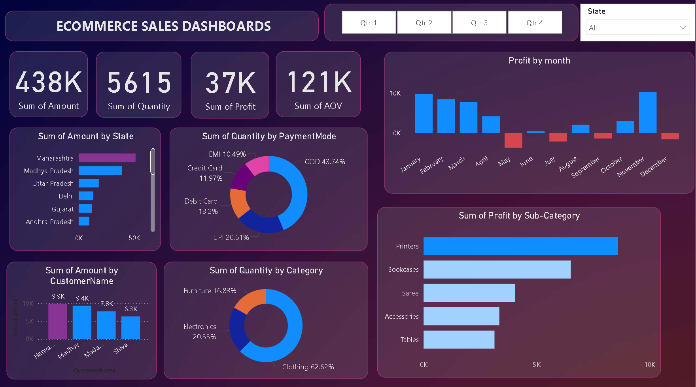
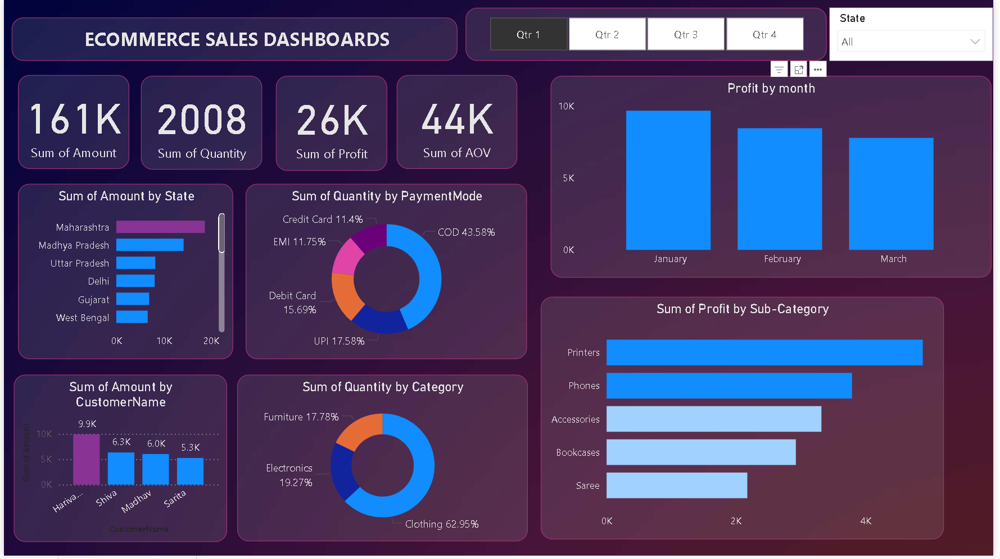
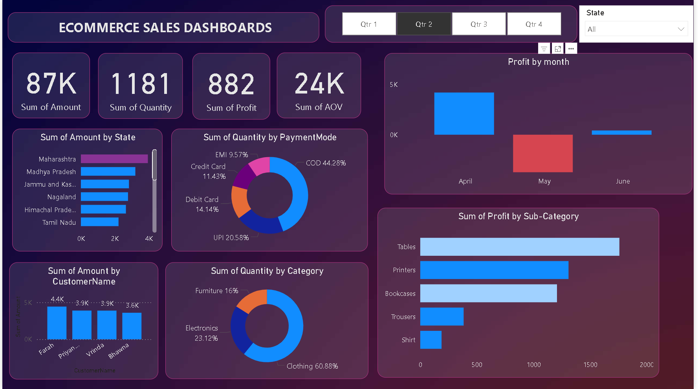
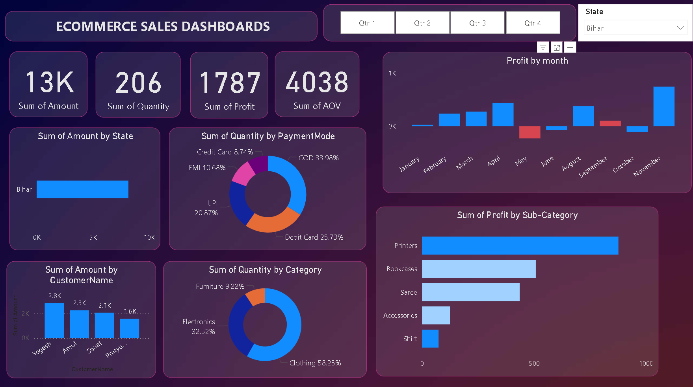

# 📊 E-Commerce Sales Dashboard | Power BI

## 🔎 Project Overview

This project presents an interactive E-Commerce Sales Dashboard built using Power BI.  
The goal of this dashboard is to analyze sales performance, profit trends, customer behavior, and regional insights in a clear and interactive way.

The dashboard enables dynamic filtering by Quarter and State to help understand business performance across time and geography.

---

## 🎯 Key Performance Indicators (KPIs)

- 💰 Total Sales: 438K
- 📦 Total Quantity Sold: 5615
- 📈 Total Profit: 37K
- 🛒 Average Order Value (AOV): 121K

All KPI values update dynamically when filters are applied.

---

## 📅 Interactive Features

- Quarter-wise Filtering (Q1, Q2, Q3, Q4)
- State-wise Sales Analysis
- Monthly Profit Trend
- Category & Sub-category Profit Analysis
- Payment Mode Distribution
- Top Customers Analysis

The dashboard automatically updates when selecting different quarters or states, enabling dynamic business analysis.

---

## 📊 Key Insights

- Maharashtra generates the highest sales revenue.
- Cash on Delivery (COD) is the most preferred payment method.
- Clothing contributes the highest sales quantity.
- Printers and Bookcases generate high profit among sub-categories.
- Profit trends vary across months, indicating seasonal performance patterns.

---

## 💡 Business Value

This dashboard helps businesses:

- Identify high-performing states
- Analyze seasonal trends
- Understand customer payment preferences
- Focus on profitable product segments
- Make data-driven decisions using interactive insights

---

## 🛠 Tools & Technologies Used

- Power BI
- DAX (Data Analysis Expressions)
- Data Modeling
- Business Intelligence Concepts
- Interactive Data Visualization

---

## 🎥 Project Demo

👉 [https://drive.google.com/file/d/1YmFIaM_Hnmel8rQm7P1v2l8u9-hdgep3/view?usp=drive_link]

---

## 📷 Dashboard Preview

### 🔹 Full Dashboard Overview

### 🔹 Q1 Analysis View

### 🔹 Q2 Analysis View

### 🔹 State-wise Analysis

---

## 📂 Project Files

- Power BI Dashboard (.pbix file)
- Dashboard Screenshots
- Demo Video Link
